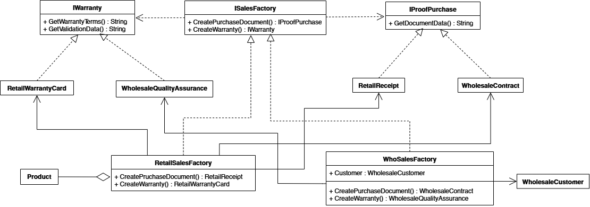

# Отчет по проекту: Система электронного документооборота (ЭДО) "SalesSystem"

## 1. Обзор проекта
**SalesSystem** — это высокотехнологичное сервисное приложение, разработанное на платформе .NET 9 с использованием языка C#. Проект представляет собой полноценную систему для автоматизации формирования юридической и финансовой документации при продаже товаров. Система поддерживает два различных сценария ведения бизнеса: **Розницу** (B2C) и **Опт** (B2B), обеспечивая для каждого из них специфический набор документов.

### Ключевые цели проекта:
*   Реализация гибкой архитектуры на базе паттернов проектирования.
*   Обеспечение "полного фарша" данных: учет подписей должностных лиц, печатей, данных поставщиков и логистических служб.
*   Создание визуально богатых документов в формате PDF.
*   Сравнение профессионального архитектурного подхода с упрощенной монолитной реализацией.

---

## 2. Архитектура системы
Проект разделен на три независимых модуля, что соответствует принципам разделения ответственности:

1.  **SalesSystem.Core**: Центральный узел системы. Здесь сосредоточены интерфейсы паттерна, реализации конкретных документов, логика шаблонизации (JSON Replace), генератор PDF и служба хранения данных (Storage Service).
2.  **SalesSystem.Api**: Серверный слой, предоставляющий REST-интерфейс. Он выступает "дирижером", который принимает запросы, валидирует наличие товаров на складе и выбирает стратегию генерации документов.
3.  **SalesSystem.Gui**: Графический интерфейс на базе WPF. Позволяет менеджеру вводить данные, выбирать тип сделки и мгновенно просматривать результат через встроенный компонент WebView2 (движок Chromium).

---

## 3. Реализация паттерна "Абстрактная Фабрика" (Abstract Factory)

Паттерн "Абстрактная Фабрика" был выбран как идеальное решение для создания семейств связанных объектов (документов) без привязки к их конкретным классам.

### Диаграмма классов
Ниже представлена визуализация структуры системы:

### Структура паттерна в коде:

#### А. Абстрактные продукты (Interfaces)
*   **IProofOfPurchase**: Контракт для документов, подтверждающих факт сделки. Обязывает реализовать метод `GetDocumentData()`.
*   **IWarranty**: Контракт для гарантийных обязательств. Обязывает реализовать методы `GetWarrantyTerms()` (условия) и `GetValidationData()` (подписи/печати).

#### Б. Конкретные продукты (Realizations)
*   **RetailReceipt** и **WholesaleContract**: Первый генерирует лаконичный чек, второй — гигантский договор поставки с реквизитами сторон.
*   **RetailWarrantyCard** и **WholesaleQualityAssurance**: Простой талон на 14 дней возврата против сложного технического регламента качества с ссылками на ГОСТы и ТУ.

#### В. Абстрактная Фабрика (ISalesFactory)
Общий интерфейс, который объединяет производство "Покупки" и "Гарантии". Код, использующий эту фабрику, не знает, какие именно классы будут созданы.

#### Г. Конкретные фабрики
*   **RetailSalesFactory**: "Начиняет" документы только базовыми данными владельца и списком товаров.
*   **WholesaleSalesFactory**: Самая сложная часть. При создании она получает "полный фарш": Покупателя с ЭЦП, Поставщика, данные Владельца (Директор, Бухгалтер) и информацию о Доставке.

---

## 4. Сравнение: Паттерн vs Монолит (Flat Approach)

В рамках исследования был реализован альтернативный подход — **FlatProcessor**. Это монолитный класс, где вся логика формирования текстов для 4-х видов документов свалена в один метод `Process` объемом в сотни строк с глубокой вложенностью `if-else`.

### Почему Абстрактная Фабрика лучше монолита:

1.  **Масштабируемость (Open-Closed Principle)**: 
    *   *В паттерне*: Чтобы добавить новый вид продажи (например, "Госзакупки"), мы просто создаем новую фабрику и два класса. Старый код не меняется.
    *   *В монолите*: Нам придется лезть в середину гигантского метода `Process`, добавлять новые `if`, что неизбежно приведет к регрессионным ошибкам в уже работающих чеках или договорах.

2.  **Управление сложностью (Encapsulation)**:
    *   *В паттерне*: Логика оптового договора инкапсулирована в классе `WholesaleContract`. Он "знает", как работать со своими тегами в JSON.
    *   *В монолите*: Все теги (для чека, договора, гарантии) перемешаны в одном месте. Риск опечатки или использования не той переменной возрастает многократно.

3.  **Дублирование кода (DRY)**:
    *   В монолитном подходе блоки замены тегов директора, печати и даты повторяются по 4-5 раз. В паттерне замена происходит централизованно внутри профильного объекта.

4.  **Тестируемость**:
    *   Паттерн позволяет протестировать генерацию розничного чека отдельно от всего остального. Монолит требует прогона всего огромного метода.

---

## 5. Техническая реализация "Полного фарша"

*   **Система шаблонов**: Мы полностью отделили юридический контент от C#-кода. Тексты договоров хранятся в JSON-файлах в папке `/Templates`. Это позволяет юристам менять условия контракта, не привлекая программиста.
*   **Storage Service (Data Layer)**: Реализована имитация базы данных на JSON-файлах. Система учитывает:
    *   Остатки товаров на складе (валидация при заказе).
    *   Статусы курьеров ("Свободен"/"В рейсе").
    *   Электронные подписи (хэши) и пути к изображениям печатей.
*   **QuestPDF**: Использована современная библиотека для верстки PDF. Она позволила реализовать:
    *   Автоматическую нумерацию страниц.
    *   Стилизацию заголовков и итоговых сумм.
    *   Специфические шрифты (Courier New) для имитации таблиц.
    *   Курсивное начертание для блоков верификации ЭЦП.

---

## 6. Алгоритм работы системы
1.  **GUI**: Менеджер вводит имя покупателя и товары в формате `Название:Кол-во`.
2.  **API**: Контроллер проверяет склад. Если товара достаточно, он выбирает способ обработки (через `appsettings.json`): либо профессиональный `PatternProcessor`, либо упрощенный `FlatProcessor`.
3.  **Обработка**: Система извлекает шаблоны из JSON, заполняет их реальными данными и передает в генератор.
4.  **Результат**: На сервере создаются PDF-файлы, пути к которым возвращаются в GUI.
5.  **Просмотр**: GUI автоматически инициализирует WebView2 и отображает готовый документ пользователю.

## 7. Заключение
Данный проект наглядно демонстрирует, что использование паттернов проектирования, таких как **Абстрактная Фабрика**, является не избыточным усложнением, а необходимостью при создании расширяемых бизнес-систем. Несмотря на то, что монолитный подход может показаться быстрее в реализации на начальном этапе, только паттерны обеспечивают долгосрочную поддержку и надежность "Enterprise" уровня.