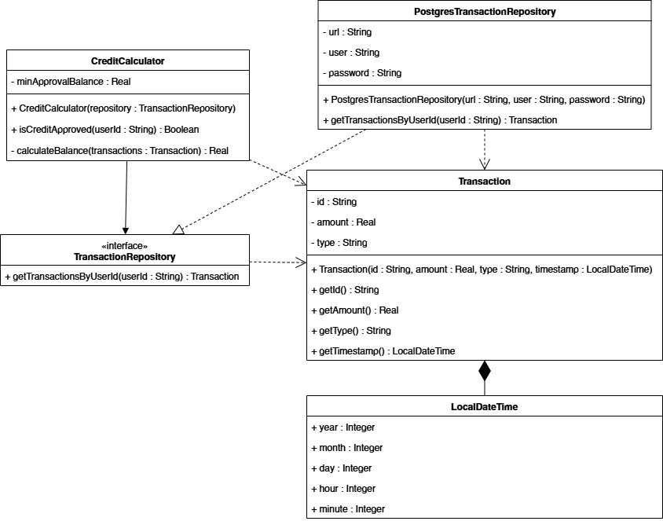

# Отчет по лабораторной работе: Архитектурный паттерн "Separated Interface" (Выделенный интерфейс)

**Цель работы:** Изучить проблему жесткой связности (tight coupling) между слоем бизнес-логики и слоем доступа к данным, а также применить паттерн *Separated Interface* для инверсии зависимостей и повышения гибкости системы.

---

## 1. Диаграмма классов приложения

Ниже представлена диаграмма классов, демонстрирующая разделение на пакеты `scoring` (бизнес-логика), `database` (инфраструктура) и `gui` (точка сборки):

---

## 2. Теоретическая справка: Суть паттерна
Паттерн **Separated Interface** решает проблему, при которой ядро приложения (клиентский код) зависит от технических деталей (например, от базы данных). 
Суть паттерна заключается в том, что интерфейс (контракт) объявляется **в том же пакете, где находится использующий его клиент**, а класс, реализующий этот интерфейс, выносится в отдельный пакет инфраструктуры. Это разворачивает вектор зависимости на 180 градусов.

---

## 3. Преимущества паттерна и их реализация в коде

Для демонстрации преимуществ в проекте реализовано два подхода: анти-паттерн (`BadCreditCalculator`) и идеальная архитектура (`CreditCalculator`).

### Преимущество 1: Инверсия зависимостей (Dependency Inversion)
* **В чем плюс:** Бизнес-логика диктует правила, а база данных под них подстраивается.
* **Где видно в коде:**
  * **Без паттерна:** Класс `BadCreditCalculator` напрямую импортирует `database.PostgresTransactionRepository`. Пакет логики зависит от пакета БД.
  * **С паттерном:** Интерфейс `TransactionRepository` лежит в пакете `scoring`. Пакет `scoring` полностью автономен (в нем нет ни одного импорта из пакета `database`). Зато класс `PostgresTransactionRepository` импортирует интерфейс из `scoring`, чтобы его реализовать. Направление зависимости успешно инвертировано.

### Преимущество 2: Слабая связность и легкость замены (Loose Coupling)
* **В чем плюс:** Можно полностью сменить технологию хранения данных (например, перейти с PostgreSQL на MongoDB или API) без единой правки в алгоритме скоринга.
* **Где видно в коде:**
  * **Без паттерна:** В конструкторе `BadCreditCalculator` жестко прописано: `this.repository = new PostgresTransactionRepository(...)`. Замена БД требует переписывания бизнес-логики.
  * **С паттерном:** `CreditCalculator` принимает абстрактный `TransactionRepository repository` через конструктор (Dependency Injection). Ему абсолютно неважно, какая база данных под капотом, главное, что она отдает список объектов `Transaction`. В файле `BankingApp.java` (наш Composition Root) мы собираем их вместе, передавая нужную БД в калькулятор.

### Преимущество 3: Изолированное тестирование
* **В чем плюс:** Сложные математические алгоритмы можно тестировать мгновенно, не поднимая реальный сервер БД и не делая сетевых запросов.
* **Где видно в коде:** 
  При использовании `CreditCalculator`, мы можем прямо в тестовом методе или GUI создать анонимный класс-заглушку (Mock), реализующий `TransactionRepository`, который вернет выдуманный список транзакций из оперативной памяти. В случае с `BadCreditCalculator` это невозможно технически, так как он сам создает подключение к БД.

---

## 4. Вывод
Внедрение паттерна *Separated Interface* защитило пакет `scoring` от влияния инфраструктурных изменений. 
Бизнес-логика (правила одобрения кредита и весовые коэффициенты рисков) теперь находится в полной изоляции, что делает код масштабируемым, легко тестируемым и соответствующим принципам SOLID (в частности, Open-Closed Principle и Dependency Inversion Principle).